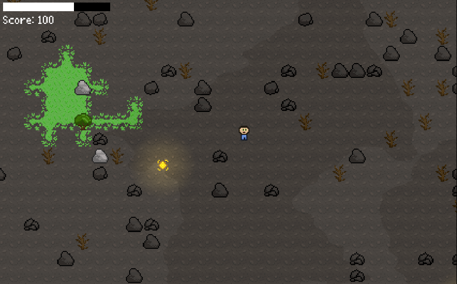

# Fading Life

In a world drained of color and warmth, one lone person roams the desolate ruins of a once-living land.
Fading Life is a minimalist pixel-art game in which you must collect elusive Life Orbs.
These flickering fragments of vitality briefly restore beauty and function to your dying surroundings.
But time is your greatest enemy. Each orb grants only a fleeting moment of breath and brightness before the world collapses back into darkness.

A game developed during the Hackathon X Gamejam 2025 at Ulm University.

Made by:

- Oliver Gerstl
- Christopher Vogel
- Thomas Schöller

Credits:

- Music by MakotoHiramatsu (CC BY 4.0): https://makotohiramatsu.itch.io/abandoned
- Sound effect by drtwelele: https://drtwelele.itch.io/casual-game-fx-one-shot
- Font: LazyFox pixel font, https://lazy-fox.itch.io/lazy-pixel-fonts

Play it on [Itch.io](https://maxatoms.itch.io/fading-life).
